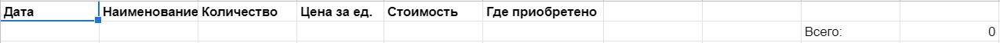

Телеграм-бот для ведения бюджета (расходов). Записывает данные в 
гугл-таблицу. Использует подключение к таблице посредством json-ключа.

"Всего" просто считается суммой. Плюс отдельно сам делю категории и 
считаю их.

Умеет:
<li/>записывать текст в формате "Что, цена", например "Проезд, 25"
<li/>принимать на вход json-файл из приложения от налоговой 
"Проверка чеков" и парсить данные в талицу
<li/>копировать страницу (для создания страницы нового месяца 
используется страница-шаблон)